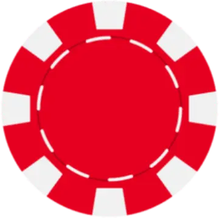

# PokerChips 

## Backend --> Justin Maher 

## Frontend --> Ramy Abdelaty 

---

This Website was created with the intention of letting people play the famous card game without involving real money and to fight against gambling addictions.
 

The idea was to make a website that is used as a digital replacement for real poker chips. Taking out the gambling aspect for the people who simply enjoy playing with friends.